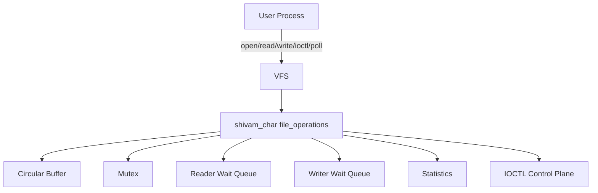

# Linux Character Device Driver with Concurrent Buffering and IOCTL Control

`shivam_char` is a production-style portfolio project that implements a
loadable Linux character-device driver with a concurrent circular buffer,
blocking and non-blocking I/O, ioctl controls, poll/select readiness, user-space
tools, integration tests, scripts, and documentation.

The device node is:

```text
/dev/shivam_char
```

## 1. Project Overview

The kernel module registers a character device and exposes a bounded
kernel-space byte buffer. User programs can open the device, write bytes, read
bytes, clear buffered data, query statistics, resize the logical capacity, set a
global non-blocking mode, and wait for readiness with `poll`.

## 2. Why This Was Built

This project demonstrates practical Linux systems skills for an entry-level
software engineering portfolio: kernel module structure, VFS callbacks,
concurrency, memory safety, user/kernel copies, ioctl ABI design, wait queues,
debuggability, shell automation, C user-space tooling, and repeatable tests.

## 3. Architecture Diagram



## 4. Kernel/User Interaction

The shared UAPI header is `include/shivam_char_ioctl.h`. The kernel module and
user-space programs include the same ioctl definitions, fixed-width structures,
ABI version, capacity limits, and mode flags.

Reads and writes are byte-stream operations. Writes are partial: if some space
is available, the driver writes what fits and returns the byte count. If no
space is available, blocking descriptors sleep and non-blocking descriptors
return `EAGAIN`.

## 5. Repository Structure

```text
linux-char-driver/
|-- README.md
|-- LICENSE
|-- Makefile
|-- Kbuild
|-- .gitignore
|-- include/
|   `-- shivam_char_ioctl.h
|-- kernel/
|   |-- shivam_char.c
|   |-- shivam_char_buffer.c
|   `-- shivam_char_buffer.h
|-- userspace/
|   |-- client.c
|   |-- concurrent_test.c
|   `-- Makefile
|-- tests/
|   |-- test_basic.sh
|   |-- test_ioctl.sh
|   |-- test_nonblocking.sh
|   |-- test_concurrency.sh
|   |-- test_poll.sh
|   `-- run_all_tests.sh
|-- scripts/
|   |-- setup.sh
|   |-- load.sh
|   |-- unload.sh
|   |-- reload.sh
|   |-- inspect.sh
|   `-- clean.sh
|-- docs/
|   |-- architecture.md
|   |-- testing.md
|   |-- design-decisions.md
|   `-- interview-notes.md
`-- .github/
    `-- workflows/
        `-- userspace-build.yml
```

## 6. Supported Features

- Dynamic character-device registration with `alloc_chrdev_region`
- `struct cdev`, class creation, and `/dev/shivam_char`
- `open`, `release`, `read`, `write`, `unlocked_ioctl`, `poll`, `no_llseek`
- Circular buffer with default 4096-byte capacity
- Safe capacity range: 256 to 65536 bytes
- Resize preserving unread bytes when possible
- Blocking and non-blocking I/O
- Wait queues for readers and writers
- `poll`, `select`, and `epoll` readiness support
- Versioned ioctl statistics ABI
- Atomic operational counters
- Rate-limited kernel warnings
- User-space CLI and pthread concurrency test
- Shell integration tests with timeout and dmesg scanning

## 7. Prerequisites

Use a disposable Ubuntu VM with a snapshot. Kernel modules run with kernel
privileges, and bugs can crash the operating system.

Install typical dependencies:

```sh
sudo bash scripts/setup.sh --install --yes
```

Or inspect requirements without installing:

```sh
bash scripts/setup.sh
```

## 8. Build Instructions

```sh
make
make module
make userspace
```

The module is built through the official external-module Kbuild path:

```sh
make -C /lib/modules/$(uname -r)/build M=$PWD modules
```

## 9. Load and Unload

```sh
sudo bash scripts/load.sh
sudo bash scripts/unload.sh
sudo bash scripts/reload.sh
```

Module parameters:

```sh
sudo bash scripts/load.sh buffer_capacity=8192 debug=1
```

For a disposable local VM only, the load script can relax device permissions:

```sh
sudo bash scripts/load.sh --chmod
```

## 10. CLI Usage

```sh
userspace/shivam_char_client write "hello world"
userspace/shivam_char_client read 64
userspace/shivam_char_client stats
userspace/shivam_char_client clear
userspace/shivam_char_client capacity
userspace/shivam_char_client resize 8192
userspace/shivam_char_client mode nonblock
userspace/shivam_char_client mode normal
userspace/shivam_char_client reset-stats
userspace/shivam_char_client poll-read 5000
userspace/shivam_char_client interactive
```

Use per-descriptor non-blocking behavior:

```sh
userspace/shivam_char_client --nonblock read 16
```

## 11. Testing

Run all integration tests in a privileged disposable VM:

```sh
make
sudo bash tests/run_all_tests.sh
```

Individual tests:

```sh
sudo bash tests/test_basic.sh
sudo bash tests/test_ioctl.sh
sudo bash tests/test_nonblocking.sh
sudo bash tests/test_poll.sh
sudo bash tests/test_concurrency.sh
```

## 12. Sample Output

```text
$ userspace/shivam_char_client write "hello world"
wrote 11 bytes

$ userspace/shivam_char_client read 11
hello world

$ userspace/shivam_char_client stats
abi_version: 1
capacity: 4096
stored_bytes: 0
available_bytes: 4096
total_bytes_read: 11
total_bytes_written: 11
```

Concurrency test output includes real measured values:

```text
writers: 4
readers: 4
messages_per_writer: 250
message_size: 64
frames_validated: 1000
validation_failures: 0
throughput_mib_s: 3.421
```

## 13. Error Scenarios

- Empty non-blocking read returns `EAGAIN`.
- Full non-blocking write returns `EAGAIN`.
- Invalid capacity returns `EINVAL`.
- Resize below unread bytes returns `EMSGSIZE`.
- Bad user pointer returns `EFAULT`.
- Interrupted blocking wait returns `ERESTARTSYS` inside the kernel path.
- Unsupported ioctl returns `ENOTTY`.
- `rmmod` while descriptors are open fails because the module is busy.

## 14. Security Considerations

Do not test unfinished kernel modules on an important host. This module never
trusts user pointers, validates ioctl commands and capacities, avoids exposing
kernel pointers, initializes exported structures, protects shared state with a
mutex, and uses rate-limited warnings for repeated bad operations.

Device permissions are not made world-writable by default. The `--chmod` loader
option is only for disposable local testing.

## 15. Known Limitations

- The driver models a virtual byte stream, not real hardware.
- There is one shared device buffer, not per-open buffers.
- It does not guarantee message boundaries.
- It does not implement async notification with `fasync`.
- Integration tests require a privileged Linux VM and matching kernel headers.

## 16. Troubleshooting

Missing headers:

```sh
sudo apt install linux-headers-$(uname -r)
```

Module already loaded:

```sh
sudo bash scripts/load.sh --force
```

Module busy:

```sh
sudo fuser -v /dev/shivam_char
sudo bash scripts/unload.sh
```

Inspect state:

```sh
sudo bash scripts/inspect.sh
dmesg | grep 'shivam_char:'
```

## 17. Interview Discussion Points

Be ready to explain why user pointers require copy helpers, why the driver uses
a mutex rather than a spinlock, how wait queues avoid busy waiting, what `poll`
returns, why ioctl structures need ABI versioning, and how cleanup unwinds
partial initialization.

See `docs/interview-notes.md` for detailed answers.

## 18. Resume Bullets

- Built a Linux character-device kernel module using `cdev`, VFS
  `file_operations`, wait queues, ioctl controls, and dynamic device-number
  registration.
- Implemented a thread-safe circular buffer with blocking/non-blocking I/O,
  partial-write semantics, poll readiness, and safe resize preserving unread
  data.
- Developed C11 user-space tools for manual operation, statistics inspection,
  ioctl control, polling, and pthread-based concurrency validation.
- Created VM-focused shell integration tests and CI-safe static checks for
  user-space builds, shell scripts, and analysis tooling.

## 19. Future Improvements

- Add `fasync`/`SIGIO` notification support.
- Add per-open buffer mode as an optional ioctl setting.
- Add tracepoints for deeper observability.
- Add kselftest-style tests for kernel-tree integration.
- Extend the design into a platform, USB, or PCIe sample driver.

## Build and Run Commands

```sh
cd linux-char-driver
bash scripts/setup.sh
make
sudo bash scripts/load.sh buffer_capacity=4096
userspace/shivam_char_client write "portfolio driver"
userspace/shivam_char_client read 16
userspace/shivam_char_client stats
sudo bash scripts/unload.sh
```

## Expected Test Sequence

```sh
make
sudo bash tests/run_all_tests.sh
```

The deterministic order is basic I/O, ioctl, non-blocking behavior, poll, and
concurrency. The runner preserves logs in `tests/logs/`.

## Common Troubleshooting Steps

```sh
make clean
make module
sudo bash scripts/reload.sh debug=1
sudo bash scripts/inspect.sh
dmesg | tail -100
```

## Final Verification Checklist

- `include/shivam_char_ioctl.h` is shared by kernel and user space.
- `Kbuild` lists both kernel objects.
- Top-level `Makefile` uses `/lib/modules/$(uname -r)/build`.
- Scripts and tests reference `shivam_char.ko` and `/dev/shivam_char`.
- Blocking waits drop the mutex before sleeping.
- Cleanup destroys device, class, cdev, device number, buffer, and context.
- User-space programs close file descriptors and free allocated memory.
- GitHub Actions builds user-space tools and avoids fake module loading.
