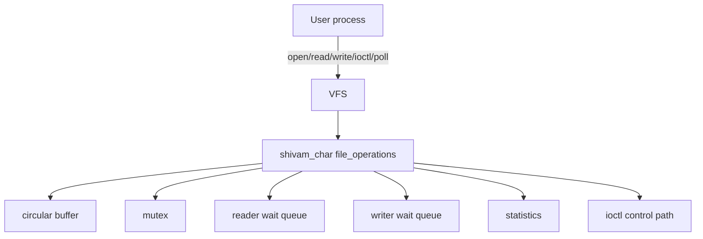

# Linux Character Device Driver with Concurrent Buffering and IOCTL Control

`shivam_char` is a small Linux character-device driver I built to practice the
parts of kernel development that are hard to learn from isolated snippets:
registration, VFS callbacks, user/kernel copies, blocking behavior,
concurrency, ioctl design, and testing from user space.

The module creates one device:

```text
/dev/shivam_char
```

It is intentionally virtual. There is no PCIe card, USB endpoint, or sensor
behind it. The point is to make the driver mechanics easy to build, break,
inspect, and explain inside a disposable Linux VM.

## 1. Project Overview

The driver exposes a shared byte stream backed by a bounded circular buffer in
kernel memory. User-space programs can:

- open and close the device
- write bytes into the kernel buffer
- read bytes back in FIFO order
- clear the buffer with ioctl
- query driver statistics
- resize the logical buffer capacity within fixed limits
- switch a global non-blocking mode on or off
- wait for readability/writability with `poll`
- exercise multiple readers and writers at the same time

This is not meant to be a clever driver. It is meant to be a readable one.

## 2. Why I Built This

I wanted a project that sits just below normal application code but is still
small enough to reason about fully. Character drivers are a good place for
that: a bug is visible from a normal shell, but the implementation still deals
with kernel memory, locking, wait queues, and ABI boundaries.

The parts I cared most about were:

- handling short reads and short writes honestly
- avoiding sleep-while-locked mistakes in blocking I/O
- making ioctl structures versioned instead of throwaway
- having tests that catch hangs instead of waiting forever
- documenting the tradeoffs, not just the happy path

## 3. Architecture Diagram



## 4. Kernel/User Interaction

Both the module and the user-space tools include
`include/shivam_char_ioctl.h`. That header is the ABI: ioctl numbers, capacity
limits, mode flags, and the statistics structure all live there.

Reads and writes behave like a byte stream. A write can be partial if the
buffer does not have enough free space. That is deliberate, because callers of
character devices need to be prepared for short I/O. If the buffer is empty or
full and the descriptor is non-blocking, the driver returns `EAGAIN`.

## 5. Repository Structure

```text
linux-char-driver/
|-- README.md
|-- LICENSE
|-- Makefile
|-- Kbuild
|-- .gitignore
|-- include/
|   `-- shivam_char_ioctl.h
|-- kernel/
|   |-- shivam_char.c
|   |-- shivam_char_buffer.c
|   `-- shivam_char_buffer.h
|-- userspace/
|   |-- client.c
|   |-- concurrent_test.c
|   `-- Makefile
|-- tests/
|   |-- test_basic.sh
|   |-- test_ioctl.sh
|   |-- test_nonblocking.sh
|   |-- test_concurrency.sh
|   |-- test_poll.sh
|   `-- run_all_tests.sh
|-- scripts/
|   |-- setup.sh
|   |-- load.sh
|   |-- unload.sh
|   |-- reload.sh
|   |-- inspect.sh
|   `-- clean.sh
|-- docs/
|   |-- architecture.md
|   |-- testing.md
|   |-- design-decisions.md
|   `-- interview-notes.md
`-- .github/
    `-- workflows/
        `-- userspace-build.yml
```

## 6. Supported Features

- Dynamic device-number allocation with `alloc_chrdev_region`
- `struct cdev`, `class_create`, and `device_create`
- `open`, `release`, `read`, `write`, `unlocked_ioctl`, `poll`, `no_llseek`
- Circular buffer with 4096-byte default capacity
- Capacity limits from 256 to 65536 bytes
- Resize that preserves unread bytes when possible
- Blocking reads and writes with wait queues
- Per-descriptor `O_NONBLOCK` handling
- Global non-blocking mode through ioctl
- `poll`, `select`, and `epoll` readiness support
- Versioned ioctl statistics ABI
- Atomic counters for common operational stats
- User-space CLI for manual testing
- Pthread-based concurrent reader/writer test
- Shell integration tests with timeouts and `dmesg` checks

## 7. Prerequisites

Use a disposable Ubuntu VM. Take a snapshot first if you can. Kernel modules
run with kernel privileges, so a bad pointer or locking mistake can bring the
machine down.

Check the expected packages:

```sh
bash scripts/setup.sh
```

Install them on Debian/Ubuntu:

```sh
sudo bash scripts/setup.sh --install --yes
```

## 8. Build Instructions

```sh
make
make module
make userspace
```

The kernel module is built the normal out-of-tree way:

```sh
make -C /lib/modules/$(uname -r)/build M=$PWD modules
```

If that path does not exist, install the matching header package for the
running kernel.

## 9. Load and Unload

```sh
sudo bash scripts/load.sh
sudo bash scripts/unload.sh
sudo bash scripts/reload.sh
```

Load with module parameters:

```sh
sudo bash scripts/load.sh buffer_capacity=8192 debug=1
```

For a throwaway VM, you can relax the device permissions:

```sh
sudo bash scripts/load.sh --chmod
```

I do not recommend doing that on a shared or important machine.

## 10. CLI Usage

```sh
userspace/shivam_char_client write "hello world"
userspace/shivam_char_client read 64
userspace/shivam_char_client stats
userspace/shivam_char_client clear
userspace/shivam_char_client capacity
userspace/shivam_char_client resize 8192
userspace/shivam_char_client mode nonblock
userspace/shivam_char_client mode normal
userspace/shivam_char_client reset-stats
userspace/shivam_char_client poll-read 5000
userspace/shivam_char_client interactive
```

Per-descriptor non-blocking read:

```sh
userspace/shivam_char_client --nonblock read 16
```

## 11. Testing

Run the full integration suite from the VM:

```sh
make
sudo bash tests/run_all_tests.sh
```

Run one test while debugging:

```sh
sudo bash tests/test_basic.sh
sudo bash tests/test_ioctl.sh
sudo bash tests/test_nonblocking.sh
sudo bash tests/test_poll.sh
sudo bash tests/test_concurrency.sh
```

The runner unloads the module on exit and stores logs under `tests/logs/`.

## 12. Sample Output

```text
$ userspace/shivam_char_client write "hello world"
wrote 11 bytes

$ userspace/shivam_char_client read 11
hello world

$ userspace/shivam_char_client stats
abi_version: 1
struct_size: 136
capacity: 4096
stored_bytes: 0
available_bytes: 4096
total_bytes_read: 11
total_bytes_written: 11
```

The concurrency test prints measured values, so throughput will vary by VM:

```text
writers: 4
readers: 4
messages_per_writer: 250
message_size: 64
writes_completed: 1000
frames_validated: 1000
missing_messages: 0
validation_failures: 0
throughput_mib_s: <depends on the VM>
```

## 13. Error Scenarios

- Empty non-blocking read returns `EAGAIN`.
- Full non-blocking write returns `EAGAIN`.
- Invalid capacity returns `EINVAL`.
- Resize below unread bytes returns `EMSGSIZE`.
- Bad user pointer returns `EFAULT`.
- Interrupted blocking waits return through the usual restart path.
- Unsupported ioctl returns `ENOTTY`.
- `rmmod` fails while a process still has the device open.

## 14. Security Considerations

The driver treats user space as untrusted. It uses `copy_to_user` and
`copy_from_user`, validates ioctl numbers and inputs, zeroes exported stats,
does not expose kernel addresses, and protects shared buffer state with a
mutex.

The scripts do not make the device world-writable unless `--chmod` is passed
explicitly. Keep that option for local VM testing.

## 15. Known Limitations

- The device is virtual and does not talk to hardware.
- There is one shared buffer for the device.
- Reads and writes are stream operations, so message boundaries are not kept.
- There is no `fasync`/`SIGIO` support.
- Full tests need root in a Linux VM with matching kernel headers.

## 16. Troubleshooting

Missing headers:

```sh
sudo apt install linux-headers-$(uname -r)
```

Module already loaded:

```sh
sudo bash scripts/load.sh --force
```

Module busy:

```sh
sudo fuser -v /dev/shivam_char
sudo bash scripts/unload.sh
```

Quick inspection:

```sh
sudo bash scripts/inspect.sh
dmesg | grep 'shivam_char:'
```

## 17. Interview Discussion Points

The useful discussion is not just "I wrote a driver." It is why the driver
uses a mutex, why user pointers go through copy helpers, how blocking I/O is
structured, how `poll` hooks into wait queues, and why ioctl ABIs are awkward
to change later.

See `docs/interview-notes.md` for short answers.

## 18. Resume Bullets

- Built a loadable Linux character-device module with dynamic device-number
  allocation, `cdev`, VFS callbacks, wait queues, and ioctl controls.
- Implemented a mutex-protected circular buffer with blocking/non-blocking
  I/O, partial writes, poll readiness, and safe capacity changes.
- Wrote C11 user-space tools for manual operation, statistics inspection,
  polling, ioctl control, and threaded concurrency validation.
- Added VM-oriented integration tests and CI-safe checks for user-space builds,
  shell scripts, and static analysis.

## 19. Future Improvements

- Add `fasync`/`SIGIO` notification.
- Add an optional per-open buffer mode.
- Add tracepoints for deeper debugging.
- Convert the shell tests into a kselftest-style layout.
- Adapt the structure into a small platform, USB, or PCIe sample driver.

## Build and Run Commands

```sh
cd linux-char-driver
bash scripts/setup.sh
make
sudo bash scripts/load.sh buffer_capacity=4096
userspace/shivam_char_client write "driver smoke test"
userspace/shivam_char_client read 17
userspace/shivam_char_client stats
sudo bash scripts/unload.sh
```

## Expected Test Sequence

```sh
make
sudo bash tests/run_all_tests.sh
```

The order is basic I/O, ioctl behavior, non-blocking behavior, poll, and then
concurrency.

## Common Troubleshooting Steps

```sh
make clean
make module
sudo bash scripts/reload.sh debug=1
sudo bash scripts/inspect.sh
dmesg | tail -100
```

## Final Verification Checklist

- `include/shivam_char_ioctl.h` is shared by kernel and user space.
- `Kbuild` lists both kernel objects.
- The top-level `Makefile` uses `/lib/modules/$(uname -r)/build`.
- Scripts and tests reference `shivam_char.ko` and `/dev/shivam_char`.
- Blocking paths drop the mutex before sleeping.
- Cleanup destroys the device, class, cdev, device number, buffer, and context.
- User-space programs close file descriptors and free allocated memory.
- GitHub Actions builds user-space tools without pretending to load the module.
