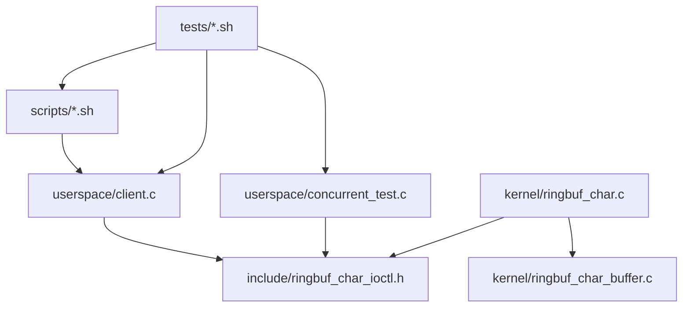

# Component Design

## Kernel Driver

Owns device registration and VFS callbacks. It should remain the only module
that knows about `struct cdev`, wait queues, user-copy helpers, and module
parameters.

## Circular Buffer

Owns byte storage mechanics. It should not know about user pointers, file
descriptors, ioctl commands, or logging.

## UAPI Header

Owns the stable contract. Any change here should be treated as an ABI decision
and documented.

## User-Space CLI

Provides manual commands and a stable surface for shell tests.

## Concurrency Test

Stress-tests the stream behavior with multiple threads and framed messages.

## Scripts and Tests

Scripts manage the VM lifecycle around the module. Tests compose scripts and
CLI commands into repeatable checks.

