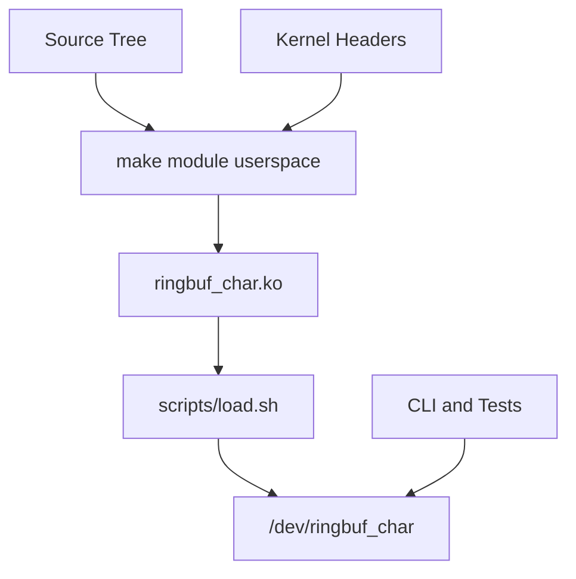

# Deployment Architecture

## Local VM Deployment



## Environments

### Development

- disposable Ubuntu VM
- local source checkout
- manual load/unload
- debug logs enabled when needed

### Testing

- clean VM snapshot
- `sudo bash tests/run_all_tests.sh`
- logs preserved in `tests/logs`
- `dmesg` scanned after tests

### Staging or Demo

- same as testing, but with a tagged source version
- module parameters documented
- demo script prepared

### Production-Like Host

This project is not intended for production hosts yet. If used outside a lab,
add module signing, package installation, stricter device permissions, release
notes, rollback instructions, and host-level monitoring.

## Rollback

For a VM demo, rollback is:

```sh
sudo bash scripts/unload.sh
git checkout <known-good-tag>
make clean
make
sudo bash scripts/load.sh
```

For an important host, use a package manager and signed release artifacts
instead of manual `insmod`.

