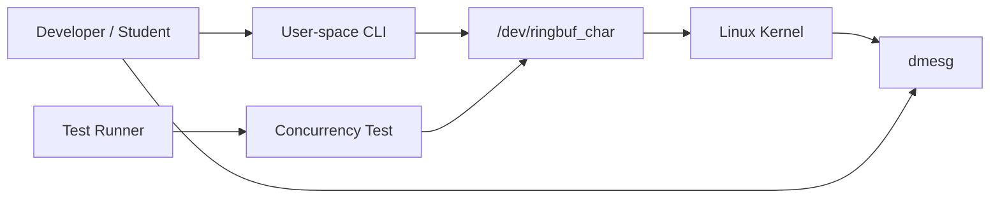

# System Context

## Users

- A developer builds and loads the module inside a VM.
- A test runner executes shell integration tests.
- An interviewer or reviewer reads the docs and code to evaluate systems
  fundamentals.

## External Systems

- Linux kernel build directory: `/lib/modules/$(uname -r)/build`
- Linux device model: creates `/dev/ringbuf_char`
- Kernel log: inspected through `dmesg`
- Optional static tools: `shellcheck`, `cppcheck`, `sparse`, `valgrind`

There are no SaaS integrations, payment systems, email providers, or external
databases in the current design.

