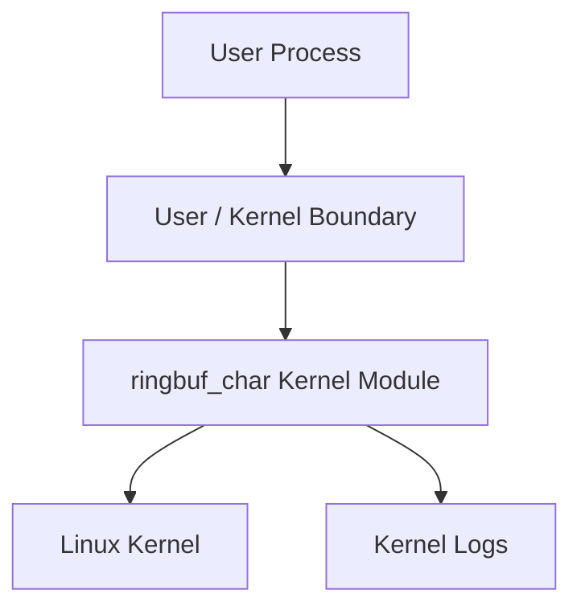

# Threat Model

## Protected Assets

- kernel memory
- kernel control flow
- host stability
- contents written by user-space processes
- ioctl ABI integrity
- logs and diagnostic output

## Entry Points

- `/dev/ringbuf_char` `open`
- `read`
- `write`
- `poll`
- ioctl commands
- module parameters
- load/unload scripts

## Trust Boundaries

The main trust boundary is between user space and kernel space. User pointers,
lengths, ioctl command values, and ioctl payloads are untrusted.

## Possible Attackers

- local user with access to the device node
- buggy test program
- malicious process sending invalid ioctl commands
- process trying to force kernel log spam
- process trying to trigger race conditions through concurrent I/O

## Likely Attacks and Mitigations

| Risk | Mitigation |
| --- | --- |
| Invalid user pointer | use `copy_to_user` and `copy_from_user` |
| Oversized allocation | fixed capacity range and validation |
| Buffer overflow | circular-buffer bounds and capacity checks |
| Data loss on resize | reject resize below unread byte count |
| Log flooding | rate-limited warnings |
| Unauthorized access | rely on Linux device permissions |
| Unload while open | `.owner = THIS_MODULE` prevents normal removal |
| Race conditions | mutex around shared buffer state |
| Sleeping with lock in wait path | drop mutex before wait queue sleep |
| ABI confusion | versioned stats structure and ioctl magic checks |

## Residual Risk

Holding the mutex during user-copy keeps the implementation simple but can make
other callers wait if a page fault is slow. The current maximum copy is bounded
by the 64 KiB capacity cap. A future high-throughput version could copy through
temporary chunks or redesign the data path.

## Sensitive Data Rules

- Do not log user-provided buffer contents.
- Do not log raw user pointers.
- Do not expose kernel addresses.
- Do not store credentials, tokens, or secrets.

