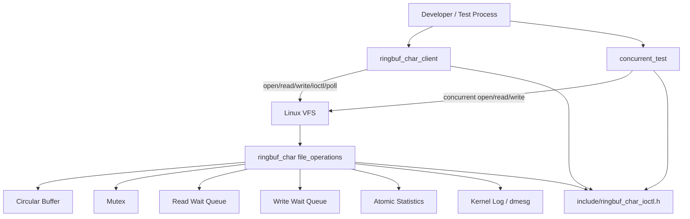
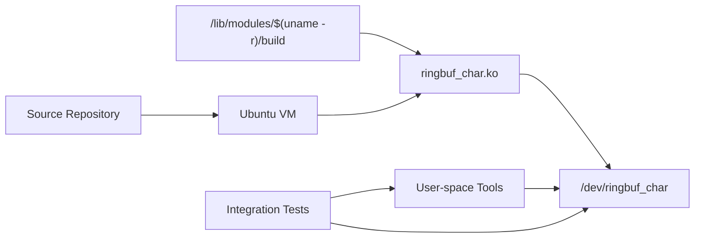

# High-Level Design

## System Overview

`ringbuf_char` is a Linux kernel character-device project. It provides a virtual
byte-stream device backed by kernel memory and controlled through read, write,
poll, and ioctl operations.

The target users are:

- students learning Linux device drivers
- interviewers reviewing systems-programming ability
- developers who want a small, runnable example of VFS callbacks and wait queues
- future maintainers extending the driver toward real hardware

The main requirements are correctness, safe user/kernel boundaries,
concurrency, debuggability, and repeatable VM-based testing. The project is not
designed for internet-scale traffic or multi-tenant SaaS workloads.

## Major Capabilities

- Register `/dev/ringbuf_char` dynamically.
- Support open, close, read, write, ioctl, poll, and no seek.
- Store bytes in a bounded circular buffer.
- Support blocking and non-blocking behavior.
- Preserve unread data during valid resizes.
- Expose operational statistics through a versioned ioctl ABI.
- Provide user-space CLI and concurrency test tools.
- Provide scripts for setup, load, unload, inspect, and cleanup.

## Expected Scale

The driver is intended for a single Linux VM or host during development. A
reasonable stress target is dozens of concurrent user-space file descriptors
and thousands to hundreds of thousands of small read/write calls during a test
run. The current buffer capacity is intentionally capped at 64 KiB.

## Engineering Constraints

- Kernel code must not trust user pointers.
- Module load/unload requires root.
- Integration tests require a privileged Linux VM.
- Device data is volatile.
- Compatibility with common Ubuntu LTS kernels matters more than using the
  newest kernel-only API.
- The project should stay simple enough to explain in an interview.

## Architecture Diagram



## Deployment View



## Request Lifecycle

The lifecycle for a user-space call is:

```text
Process
  -> libc syscall wrapper
  -> Linux syscall entry
  -> VFS
  -> ringbuf_char file_operations
  -> circular buffer / ioctl handler
  -> user-copy helpers
  -> return value or errno
```

For ioctl calls, user space and kernel space agree on command numbers and
payload structures through `include/ringbuf_char_ioctl.h`.

## Read Path

1. User calls `read(fd, buffer, count)`.
2. VFS dispatches to `ringbuf_char_read`.
3. The driver increments the read-call counter.
4. If `count` is zero, the driver returns zero.
5. The driver takes the mutex and checks whether data exists.
6. If empty and non-blocking, it returns `-EAGAIN`.
7. If empty and blocking, it drops the mutex and waits on `read_queue`.
8. After wakeup, it reacquires the mutex and rechecks state.
9. It copies available bytes to user space with `copy_to_user`.
10. It consumes bytes from the circular buffer.
11. It updates byte counters and wakes writers.

## Write Path

1. User calls `write(fd, data, count)`.
2. VFS dispatches to `ringbuf_char_write`.
3. The driver increments the write-call counter.
4. If `count` is zero, the driver returns zero.
5. The driver takes the mutex and checks available capacity.
6. If full and non-blocking, it returns `-EAGAIN`.
7. If full and blocking, it drops the mutex and waits on `write_queue`.
8. After wakeup, it reacquires the mutex and rechecks state.
9. It copies as much as currently fits with `copy_from_user`.
10. It commits bytes into the circular buffer.
11. It updates byte counters and wakes readers.

## Control Write Path

Ioctl operations that mutate state follow this pattern:

1. Validate ioctl magic and command number.
2. Copy and validate user input if the command has a payload.
3. Take the mutex for buffer or mode changes.
4. Apply the change.
5. Increment the state-generation counter.
6. Release the mutex.
7. Wake readers and/or writers when the change affects readiness.
8. Log important state changes.

## Consistency Model

The circular buffer is strongly consistent inside one kernel instance because
all buffer mutations are protected by the same mutex. Statistics are eventually
consistent at the individual-counter level because they are stored in atomics
and read as a snapshot.

That is acceptable because stats are observability data, not business state.

## How I Would Explain This System in an Interview

I would start with the requirement: expose a byte-stream device from the kernel
to user space and make it safe under concurrent readers and writers. The high
level design is a loadable module registered through `cdev`; the VFS dispatches
system calls into `file_operations`; the driver stores bytes in a circular
buffer protected by a mutex; wait queues handle blocking behavior; ioctl
provides the control plane; and user-space tests exercise the ABI.

The important tradeoff is keeping the module simple and local to one kernel
instance. I would not introduce distributed systems pieces unless the project
grew into a daemon-managed fleet or hardware-backed product. The current scale
bottlenecks are lock contention on the shared buffer, copy cost across the
user/kernel boundary, and the fixed 64 KiB capacity cap.

