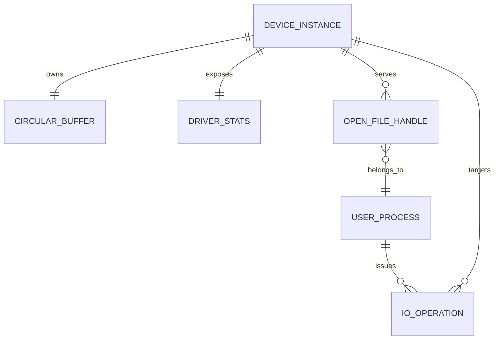

# State and Database Design

This project does not use an external database. The important state lives in
kernel memory and disappears when the module unloads. Calling this file
`database-design.md` keeps the system-design package complete, but the design
is really an in-kernel state model.

## In-Kernel State

| Entity | Storage | Lifetime | Notes |
| --- | --- | --- | --- |
| Device registration | `dev_t`, `struct cdev`, class, device | module load to unload | Publishes `/dev/ringbuf_char` |
| Circular buffer | `struct ringbuf_char_buffer` | module load to unload | Stores unread bytes |
| Statistics | `atomic64_t` counters | module load to unload or reset | Observability only |
| Mode | `u32 mode` | module load to unload | Controls global non-blocking behavior |
| Waiters | wait queues | runtime only | Managed by the kernel scheduler |

## Logical ER Diagram

This is a logical model, not SQL schema.

## Constraints

- One `DEVICE_INSTANCE` exists in the current implementation.
- Capacity must be between 256 and 65536 bytes.
- Stored bytes cannot exceed capacity.
- `read_pos` and `write_pos` must always be within capacity.
- Resize cannot discard unread data.
- Counters must never expose kernel pointers or uninitialized memory.

## Indexes

There are no database indexes. The buffer uses direct array offsets, and all
operations are O(bytes copied) with O(1) metadata updates.

If a future telemetry daemon stored stats in PostgreSQL, useful indexes would
be:

- `(captured_at)` for time-range charts
- `(host_id, captured_at)` for per-host operational history
- `(module_version, captured_at)` for release comparisons

## Soft Deletion

Not applicable. Buffered bytes are consumed by reads or removed by clear.

## Audit Fields

The kernel module does not store durable audit records. Security-sensitive
actions are visible through kernel logs and counters. A future management
daemon could persist append-only audit events such as module load, unload,
capacity change, mode change, and repeated invalid ioctl attempts.

## Query Performance Strategy

There are no database queries, but the same performance principles apply:

- avoid unbounded copies by capping capacity
- avoid expensive allocation on every I/O operation
- keep stats reads bounded and fixed-size
- avoid logging in hot read/write paths
- keep lock hold times understandable

