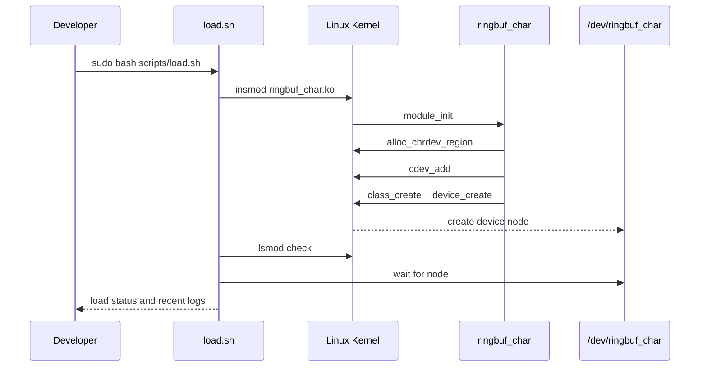
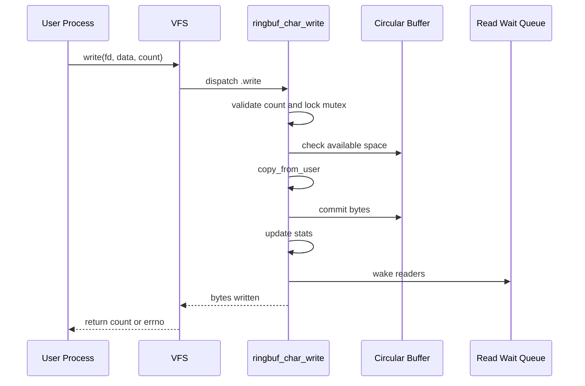
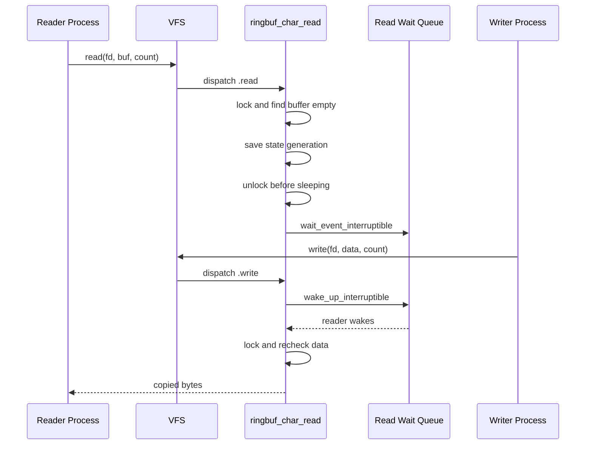
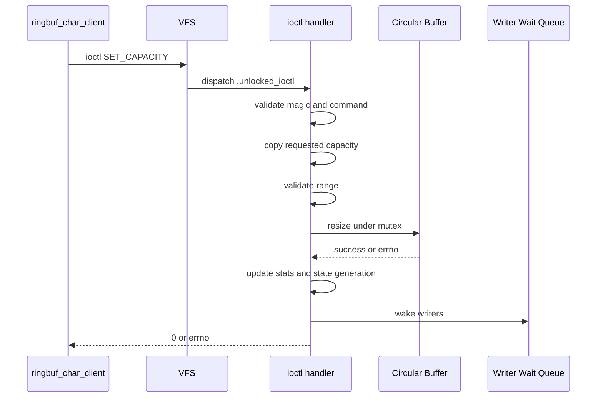
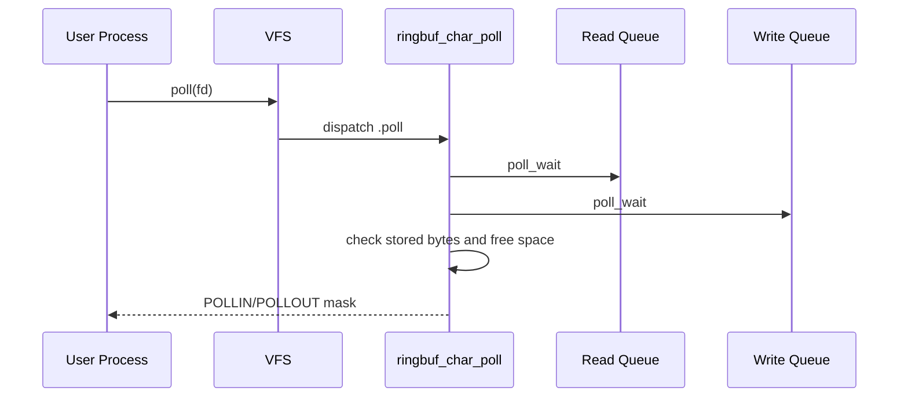
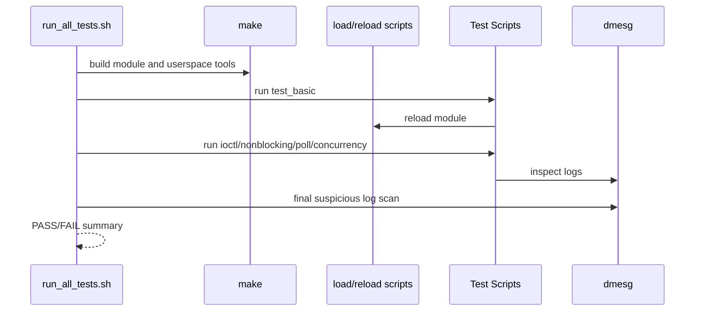

# Sequence Diagrams

## Module Load

```mermaid
sequenceDiagram
    participant Dev as Developer
    participant Script as load.sh
    participant Kernel as Linux Kernel
    participant Module as ringbuf_char
    participant DevNode as /dev/ringbuf_char

    Dev->>Script: sudo bash scripts/load.sh
    Script->>Kernel: insmod ringbuf_char.ko
    Kernel->>Module: module_init
    Module->>Kernel: alloc_chrdev_region
    Module->>Kernel: cdev_add
    Module->>Kernel: class_create + device_create
    Kernel-->>DevNode: create device node
    Script->>Kernel: lsmod check
    Script->>DevNode: wait for node
    Script-->>Dev: load status and recent logs
```

## Basic Write

```mermaid
sequenceDiagram
    participant App as User Process
    participant VFS as VFS
    participant Driver as ringbuf_char_write
    participant Buffer as Circular Buffer
    participant WaitQ as Read Wait Queue

    App->>VFS: write(fd, data, count)
    VFS->>Driver: dispatch .write
    Driver->>Driver: validate count and lock mutex
    Driver->>Buffer: check available space
    Driver->>Driver: copy_from_user
    Driver->>Buffer: commit bytes
    Driver->>Driver: update stats
    Driver->>WaitQ: wake readers
    Driver-->>VFS: bytes written
    VFS-->>App: return count or errno
```

## Blocking Read

```mermaid
sequenceDiagram
    participant Reader as Reader Process
    participant VFS as VFS
    participant Driver as ringbuf_char_read
    participant RQ as Read Wait Queue
    participant Writer as Writer Process

    Reader->>VFS: read(fd, buf, count)
    VFS->>Driver: dispatch .read
    Driver->>Driver: lock and find buffer empty
    Driver->>Driver: save state generation
    Driver->>Driver: unlock before sleeping
    Driver->>RQ: wait_event_interruptible
    Writer->>VFS: write(fd, data, count)
    VFS->>Driver: dispatch .write
    Driver->>RQ: wake_up_interruptible
    RQ-->>Driver: reader wakes
    Driver->>Driver: lock and recheck data
    Driver-->>Reader: copied bytes
```

## Capacity Resize

```mermaid
sequenceDiagram
    participant CLI as ringbuf_char_client
    participant VFS as VFS
    participant Driver as ioctl handler
    participant Buffer as Circular Buffer
    participant WQ as Writer Wait Queue

    CLI->>VFS: ioctl SET_CAPACITY
    VFS->>Driver: dispatch .unlocked_ioctl
    Driver->>Driver: validate magic and command
    Driver->>Driver: copy requested capacity
    Driver->>Driver: validate range
    Driver->>Buffer: resize under mutex
    Buffer-->>Driver: success or errno
    Driver->>Driver: update stats and state generation
    Driver->>WQ: wake writers
    Driver-->>CLI: 0 or errno
```

## Poll Readiness

```mermaid
sequenceDiagram
    participant App as User Process
    participant VFS as VFS
    participant Driver as ringbuf_char_poll
    participant RQ as Read Queue
    participant WQ as Write Queue

    App->>VFS: poll(fd)
    VFS->>Driver: dispatch .poll
    Driver->>RQ: poll_wait
    Driver->>WQ: poll_wait
    Driver->>Driver: check stored bytes and free space
    Driver-->>App: POLLIN/POLLOUT mask
```

## Integration Test Run

```mermaid
sequenceDiagram
    participant Runner as run_all_tests.sh
    participant Make as make
    participant Load as load/reload scripts
    participant Tests as Test Scripts
    participant Dmesg as dmesg

    Runner->>Make: build module and userspace tools
    Runner->>Tests: run test_basic
    Tests->>Load: reload module
    Runner->>Tests: run ioctl/nonblocking/poll/concurrency
    Tests->>Dmesg: inspect logs
    Runner->>Dmesg: final suspicious log scan
    Runner-->>Runner: PASS/FAIL summary
```

